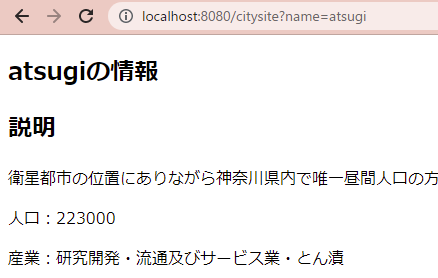
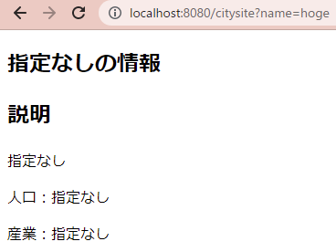

# 第7回 課題 REST API 表面実装

GET/ POST/ PATCH/ DELETE を仮実装する。    
JSONレスポンスをするための @RestController を用意し、  
GETについては HTMLレスポンスのための @Controllerを作成した。

`out.txt` は `CheckStyle` による出力ファイル。  
Javadocに関する警告と、100文字制限の警告は無視した。

## アプリ想定

都市の情報を管理するアプリケーション。

- name: 都市名
- description: 都市の説明
- population: 都市の人口
- industrie: 主要産業

上記の4つのデータを持つアプリと想定した。  
各APIの機能は以下のように想定している。

### GET(HTML) [/citysite]

- アクセス先: `/citysite`
- パラメータ変数: `name`

パラメータにアルファベットで都市名を指定すると該当の都市情報をHTMLで取得できる。  
課題では「浦安市」「厚木市」の疑似データを入れている。  
urayasu, atsugi, 以外は「指定なし」となる。

例）`localhost:8080/city?name=urayasu` へアクセス



例）`localhost:8080/city?name=hoge` へアクセス



### GET(JSON) [/city/data]

- アクセス先: `/city/data`
- パラメータ変数: `name`

同様に浦安市か厚木市の情報をJSONで取得できる。

例）

```bash
> curl -X GET 'localhost:8080/city?name=atsugi'
```

```
[
  "atsugi",
  "衛星都市の位置にありながら神奈川県内で唯一昼間人口の方が多い産業都市としての側面を持つ。交通要所とされるが山間・農業地帯も多い。",
  "223000",
  "研究開発・流通及びサービス業・とん漬"
]
```

### POST [/city]

- アクセス先: `/city`
- Request Body
  - cityName: Null無効 / アルファベットのみ
  - cityDescription: 入力自由
  - cityPopulation: 数字1桁～10桁まで
  - cityIndustrie: 入力自由

都市情報を登録するためのAPIで、登録した情報を返す。  
バリデーション違反時は処理内で例外を捉える。  
例外を捉えた場合は Bad Request と String を返す。

また、データベースへのアクセスを模したハリボテ機能として  
Request Body から受け取ったデータは、Service の専用メソッドを通る。  
メソッドはそのままデータを返し、Controller内でターミナルに出力される。

例）`localhost:8080/city` へアクセス  
Request Body は以下の通り

```
{
    "cityName": "urayasu",
    "cityDescription": "disney",
    "cityPopulation": "1234",
    "cityIndustrie": "中核都市・小売卸商業・薩摩切子"
}
```

`201 Created` として以下の出力となる

```
city registered.
```

ターミナルには以下が出力される
```
urayasu
disney
1234
中核都市・小売卸商業・薩摩切子
```

例）無効な Request Body を送信する（人口を空白に）

```
{
    "cityName": "urayasu",
    "cityDescription": "disney",
    "cityPopulation": "",
    "cityIndustrie": "中核都市・小売卸商業・薩摩切子"
}
```

`400 Bad Request` として以下の出力となる

```
Invalid value.
```

### PATCH [/city/{cityName}]

- アクセス先: `/city/{cityName}`
- Request Body は上記と同様

登録されている都市情報を変更するためのAPIで、変更した情報を返す。  
都市の指定は `{cityName}` 部分で行う。

変更した後の都市情報というハリボテデータをJSONで返す。

バリデート違反時は Bad Request と JSON を返す。

例）`localhost:8080/city/urayasu` にアクセスする。
Request Body は以下の通り。

```
{
    "cityName": "urayasu",
    "cityDescription": "disney",
    "cityPopulation": "1234",
    "cityIndustrie": "中核都市・小売卸商業・薩摩切子"
}
```

`200 OK` として以下の出力となる

```
{
    "Message": [
        "urayasu",
        "disney",
        "1234",
        "中核都市・小売卸商業・薩摩切子"
    ]
}
```

バリデーション違反となるデータを送信した場合は以下のようになる

```
{
    "Message": [
        "Invalid value."
    ]
}
```

### DELETE(HTML) [/city/{cityName}]

- アクセス先: `/city/{cityName}`
- Request Body は不要

エンドポイントで指定した都市がデータで存在していれば  
都市情報を削除するハリボテ機能が働く。

ハリボテデータに存在しない場合は Not Found を返す。

例）`localhost:8080/city/urayasu` にアクセスする。

`200 OK` として以下の出力となる。

```
Deleted urayasu city information.
```

例）`localhost:8080/city/atsugi` にアクセスすると同様に

```
Deleted atsugi city information.
```

urayasu, atsugi 以外のエンドポイントの場合は以下のようになる  
この場合は `404 Not Found` が返る。

```
City not found.
```